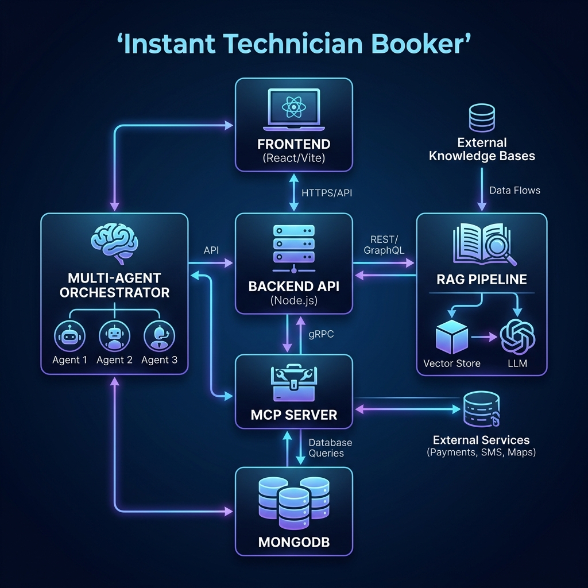
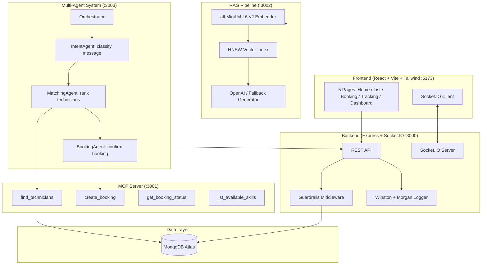

# Instant Technician Booker

> A production-grade, AI-powered home services platform. Book nearby plumbers, electricians, AC technicians and more — instantly. Built to demonstrate MCP, RAG, multi-agent systems, guardrails, and observability.

---

## 🎯 Problem Statement & Solution

**Problem**: 
Home service booking (plumbing, electrical, etc.) is traditionally fragmented, lacking real-time availability, transparent pricing, and efficient matching. Users often struggle with manual coordination and lack of immediate support for common queries.

**Solution**:
A unified AI-driven platform that automates the technician discovery and booking lifecycle. By integrating a **Multi-Agent Orchestrator**, **RAG-based FAQ**, and **MCP-compatible tools**, the system provides:
- **Instant Matching**: Autonomous agents find the best technician based on skill and distance.
- **Agentic Booking**: Natural language interface for end-to-end booking.
- **Smart Support**: RAG pipeline for instant, context-aware answers to service questions.
- **Safety First**: Built-in guardrails for validation and security.

---

## 🛠 Tech Stack

| Layer | Technologies |
|---|---|
| **Frontend** | React, Vite, Tailwind CSS, Socket.io-client, React Router, Leaflet (Maps) |
| **Backend** | Node.js, Express, Socket.io, Mongoose, Zod, JWT |
| **AI / RAG** | Transformers.js (all-MiniLM-L6-v2), HNSW Vector Index, OpenAI API |
| **Agents** | Custom Multi-Agent Orchestration (Intent, Matching, Booking agents) |
| **Infrastructure** | MCP (Model Context Protocol), MongoDB (In-Memory for Dev) |
| **Observability** | Winston (Structured Logs), Morgan (HTTP Logs) |

---

## 🏗 Architecture





---

## Key Concepts Implemented

| Concept | Implementation |
|---|---|
| **MCP** | Custom Model Context Protocol server exposing 4 tools (`find_technicians`, `create_booking`, etc.) — compatible with Claude Desktop |
| **RAG** | Local embedding (all-MiniLM-L6-v2) + vector index over FAQ Q&A pairs, with OpenAI generation and fallback |
| **Multi-Agent** | 3-agent pipeline: IntentAgent (classify) → MatchingAgent (rank) → BookingAgent (confirm), with reasoning logged |
| **Guardrails** | Profanity filter, 50km distance check, skill mismatch validation, Zod schema validation, rate limiting (20 req/min) |
| **Observability** | Winston structured JSON logs, Morgan HTTP logs, agent reasoning log, RAG query log, guardrail violation log |

---

## Setup & Running

### 1. Configure Environment
Ensure you have a `.env` file in the root. The project is pre-configured to use **In-Memory MongoDB**, so no database setup is required for development.

```bash
# Optional: Add OpenAI key for better AI features
OPENAI_API_KEY=sk-...
```

### 2. Install & Start Everything
From the root directory:

```bash
npm run install:all    # Install all dependencies for all workspaces
npm run dev:all        # Start Backend, Frontend, RAG, and Agents simultaneously
```

### 3. Build Vector Index (Run once)
To use the RAG FAQ system, you need to generate the local embeddings:

```bash
npm run embed --workspace=rag
```

---

## Demo Credentials

The system is pre-seeded with the following accounts for testing:

| Account | Email | Password | Role |
|---|---|---|---|
| **Customer** | `customer@itb.dev` | `User@1234` | Demo user to book services |
| **Plumber** | `rajan@itb.dev` | `Tech@1234` | Technician to accept jobs |
| **Electrician** | `selvam@itb.dev` | `Tech@1234` | Technician to accept jobs |
| **AC Tech** | `deepa@itb.dev` | `Tech@1234` | Technician to accept jobs |

---

## Connecting MCP Server to Claude Desktop

Add this to your Claude Desktop config (`~/Library/Application Support/Claude/claude_desktop_config.json` on Mac or `%APPDATA%\Claude\claude_desktop_config.json` on Windows):

```json
{
  "mcpServers": {
    "instant-technician-booker": {
      "command": "node",
      "args": ["C:/path/to/rag_project/mcp-server/src/index.js"],
      "env": {
        "MONGO_URI": "mongodb://localhost:27017/instant_technician_booker"
      }
    }
  }
}
```

After connecting, Claude can use `find_technicians`, `create_booking`, `get_booking_status`, and `list_available_skills` as tools.

---

## Running Tests

```bash
cd tests
npm install
npm test           # All tests
npm run test:unit  # Unit tests only
npm run test:integration  # Integration tests (requires MongoDB)
```

---

## API Reference

| Method | Route | Auth | Description |
|---|---|---|---|
| POST | `/api/auth/register` | No | Register user/technician |
| POST | `/api/auth/login` | No | Login, get JWT |
| GET | `/api/technicians/nearby?lat=&lng=&skill=` | No | Find nearby technicians |
| GET | `/api/technicians/dashboard` | Technician | Active jobs |
| POST | `/api/bookings` | User | Create booking |
| GET | `/api/bookings/:id` | Auth | Get booking |
| PATCH | `/api/bookings/:id/status` | Auth | Update status |
| POST | `/api/rag/ask` | No | Ask FAQ question |
| POST | `/api/agent/book` | No | AI agent booking |
| GET | `/api/metrics` | No | Platform stats |
| GET | `/health` | No | Health check |

---

## Log Files

All logs are written to `/logs/`:

| File | Contents |
|---|---|
| `app.log` | All backend API logs (JSON) |
| `error.log` | Errors only |
| `agent_reasoning.log` | Step-by-step agent reasoning |
| `rag_queries.log` | RAG queries + retrieved chunks |
| `guardrail_violations.log` | All guardrail trigger events |

---

## 🚀 Proposed Roadmap

- [ ] **Real-world Payment Integration**: Connect Stripe or PayPal for secure transactions.
- [ ] **Voice Interface**: Enable voice-based booking via Whisper and TTS.
- [ ] **Advanced Agent Negotiation**: Allow agents to negotiate pricing/time slots based on technician availability.
- [ ] **Geofencing**: Automated check-in/check-out for technicians using GPS.
- [ ] **Multi-provider MCP**: Connect to third-party CRM systems via MCP.

---

## License

MIT

